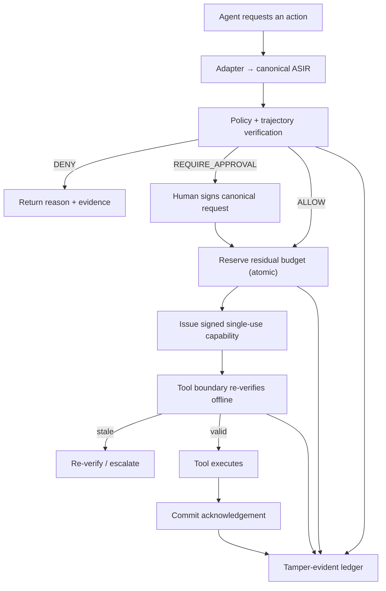

# VERITAS

**Verified Execution Boundary for Autonomous Agents** · research prototype, Cycle 1 · v0.1.2

> Put a verifiable checkpoint between an AI agent and consequential tools — payments, databases, e-mail, infrastructure — and evaluate each request against the relevant recorded trajectory, current state, and policy.

> [!WARNING] VERITAS is research and evaluation software, not a production security control. Keep the repository private until the prior-art and intellectual-property review is complete. See [LICENSE-PROVISIONAL.md](LICENSE-PROVISIONAL.md).
> [!IMPORTANT]
> The Python API is experimental and pre-1.0. Only names exported by `veritas` and documented in
> [Public API Reference](docs/API_REFERENCE.md) are supported for library consumers. TestPyPI and
> PyPI publication remain disabled pending the IP and final-license decision.

### 90-second thesis

We are not trying to make the agent trustworthy. We are making execution verifiable.

```bash
veritas demo
```

Independent per-call policy (`B1 = Policy(a_t)`) allows twelve transfers of 900 against a 10,000 rolling limit (spent 10,800). VERITAS (`V(a_t | H, S, P)`) allows eleven and denies the twelfth (spent 9,900). A direct call to the payment tool without a capability is rejected (`VALID_CAPABILITY_REQUIRED`).

See [v0.1-present freeze](docs/V01_PRESENT.md), [prior art](docs/PRIOR_ART.md), and [speaker notes](present/SPEAKER_NOTES.md).

---

## Choose your path

| If you are… | Start here | Time |
| --------------------------------------------------- | ------------------------------------------------------------------------------------------------------------------------------------------------------------------------------------------------------------------------------------------------------------------------------------------------------------------------------------------------------------------------ | ------ |
| A decision-maker, risk owner, or auditor (no code) | [docs/FOR_OPERATORS.md](docs/FOR_OPERATORS.md) → [The problem in 60 seconds](#the-problem-in-60-seconds) | 10 min |
| Deciding whether this matters for your organization | [The problem in 60 seconds](#the-problem-in-60-seconds) → [Where it applies](#where-it-applies) → [What a decision looks like](#what-a-decision-looks-like)                             | 5 min  |
| An engineer who wants to run it                     | [Quick start](#quick-start) → [docs/FOR_ENGINEERS.md](docs/FOR_ENGINEERS.md) → [Integrate with your agent](#integrate-with-your-agent) | 20 min |
| A security, IAM, or compliance reviewer             | [Rules the system enforces](#rules-the-system-enforces) → [Adversarial benchmark](#adversarial-benchmark) → [Assumptions and what is not claimed](#assumptions-and-what-is-not-claimed) | 30 min |
| A researcher                                        | [Coordination modes](#coordination-modes) → [Formal scope](#solver-and-formal-verification-scope) → [docs/](docs/)                                                                                                          | 1 h    |

---

## The problem in 60 seconds

An AI assistant is allowed to move money, with one rule: *no single transfer above 10,000*.

It receives a poisoned e-mail and decides to send **twelve transfers of 900** to the same account. Every transfer is under the limit. Together they move **10,800**. The rule never fires.

This is not a bug in the rule. It is a limit of *asking the question one request at a time*. The same blind spot appears whenever:

| Pattern | Plain description | Example |
| ---------------------------------- | ------------------------------------------------------ | ------------------------------------------------------ |
| **Composition**                    | Safe steps add up to an unsafe whole                   | Twelve small transfers; many small data exports        |
| **Concurrency**                    | Two agents spend the same remaining budget at once     | Both read "9,100 left", both send 9,000                |
| **Stale state**                    | The world changes between "checked" and "done"         | Balance dropped; policy was tightened five seconds ago |
| **Replay**                         | A valid authorization is used twice                    | Same signed token, two executions                      |
| **Approval mutation**              | A human approves one thing, the agent executes another | Approved 900, executed 9,000                           |
| **Cross-tool sequences**           | Two allowed tools, one forbidden order                 | Read customer PII, then e-mail an external address     |

VERITAS changes the question from *"is this request allowed?"* to *"is this request still safe given everything that already happened, everything happening right now, the current state, and the exact policy that was verified?"*

### Three analogies

- **A hotel hold on a credit card.** VERITAS *reserves* the budget before the action, so two agents cannot both spend the last 900.
- **A boarding pass, not a passport.** The agent never holds a standing "can transfer money" right. It gets a single-use pass for *this* transfer, to *this* account, valid for seconds, tied to the state that was checked.
- **A tamper-evident logbook.** Every decision is chained by hash. If anyone edits one line, the chain breaks and the edit is visible.

---

## Where it applies

VERITAS sits between an agent framework (LangGraph, MCP tools, or custom code) and a *consequential* tool. It does not replace the agent, the LLM, your identity provider, or your firewall. It adds one thing: a trajectory-aware, cryptographically bound authorization step.

| Domain | Consequential tool | Example invariant |
| -------------------------------------------------------- | --------------------- | ------------------------------------------------------------------------------------ |
| Finance / treasury agents                                | Payment API           | Rolling budget per destination; human approval above threshold; approver ≠ initiator |
| Customer support agents                                  | CRM + e-mail          | Never send externally after reading sensitive fields in the same session             |
| DevOps / SRE agents                                      | Cloud or database API | No destructive statements; bounded number of changes per hour; delegation depth ≤ N  |
| Procurement / back-office                                | ERP, vendor portals   | Cumulative spend per vendor per month; single-use approvals                          |
| Multi-agent orchestration                                | Any shared quota      | One global budget shared safely across many agents, with a measurable autonomy cost  |

**When VERITAS is the wrong tool:** read-only agents, tools with no blast radius, or systems where the tool cannot (or will not) verify a token before acting. See [Assumptions](#assumptions-and-what-is-not-claimed).

---

## What a decision looks like

Every request ends in one of four outcomes. The last column is what a *person* does about it.

| Outcome | Meaning | What happens next |
| ---------------------------------- | ---------------------------------------------------------------------------- | ----------------------------------------------------------------------------------------------------------------------- |
| `ALLOW`                            | Policy and trajectory checks pass; budget reserved; signed capability issued | Tool executes; reservation commits on acknowledgement                                                                   |
| `DENY`                             | A rule, budget, ordering, or relationship check failed                       | Agent receives a machine-readable reason (e.g. `BUDGET_EXHAUSTED`); nothing executes                                    |
| `REQUIRE_APPROVAL`                 | The action is admissible only with a human signature                         | A reviewer sees a deterministic rendering and signs **exactly** that request; any later change invalidates the approval |
| `STALE_CAPABILITY`                 | State or policy changed between verification and execution                   | Re-verify (bounded retries), then escalate to a human                                                                   |

The following is a **conceptual decision envelope**, included to show what explainable denial evidence can look like. It is not literal CLI output from Cycle 1:

```json
{
  "decision": "DENY",
  "reason": "BUDGET_EXHAUSTED",
  "invariant": "money:acct-987:24h",
  "requested": 900,
  "residual_before": 100,
  "policy_version": "v1",
  "ledger_node": "sha256:…"
}

```

This structure illustrates how a person could read *what* was asked, *which rule* stopped it, *how much* was left, and *where* the evidence lives. Consult the actual CLI output and API reference for implemented fields.

---

## The result in one minute

```bash
veritas demo

```

Twelve transfers of 900 against a rolling 24-hour budget of 10,000:

```json
{
  "allowed": 11,
  "denied": 1,
  "twelfth_decision": "DENY",
  "used": 9900,
  "ledger_integrity": true
}

```

A request-by-request filter would allow all twelve. The full output lists every decision and the remaining budget after each one.

---

## Quick start

**Validated environment:** Windows and Python 3.13. Other versions may work according to `pyproject.toml`, but they were not reproduced in the validation reported here. Git and PowerShell or a POSIX shell are required for the workflows below; Docker is optional. No cloud account, API key, LLM, external database, or paid service is needed.

<details>
<summary><strong>Windows PowerShell</strong></summary>

```powershell
py -3.13 -m venv .venv
.\.venv\Scripts\Activate.ps1
python -m pip install --upgrade pip
python -m pip install -e .
veritas demo
veritas bench
python -W error::ResourceWarning -m unittest discover -s tests -v

```

If activation is blocked, call the interpreter directly: `.\.venv\Scripts\python.exe -m veritas demo`. List installed Pythons with `py -0p`.

</details>

<details>
<summary><strong>Linux / macOS</strong></summary>

```bash
python3 -m venv .venv
source .venv/bin/activate
python -m pip install --upgrade pip
python -m pip install -e .
veritas demo
veritas bench
python -W error::ResourceWarning -m unittest discover -s tests -v

```

</details>

<details>
<summary><strong>Docker</strong></summary>

```bash
docker compose run --rm veritas demo
docker compose run --rm veritas bench

```

</details>

### Five-minute tour

| Step | Command | What to look for |
| ------------------------------ | --------------------------------------------------- | ----------------------------------------------------------------------- |
| 0                              | `veritas doctor`                                    | `healthy` — this machine can compile policy and write a local store     |
| 1                              | `veritas demo`                                      | Transfer 12 denied with `BUDGET_EXHAUSTED`; `ledger_integrity: true`    |
| 2                              | `veritas bench`                                     | Eleven scenarios, each naming the attack and the rule that stopped it   |
| 3                              | `veritas reasons BUDGET_EXHAUSTED`                  | Operator text and engineer text for the same code                       |
| 4                              | `veritas policy-check policies/payment_policy.json` | A compiled policy and a concrete fractionation counterexample           |
| 5                              | `veritas ledger-verify <path>/veritas.db`           | Every stored node re-hashed and verified                                |
| 6                              | `veritas perf --iterations 1000`                    | Local cost of table lookup and signature verification on *your* machine |

### Use VERITAS as a Python library

After `python -m pip install -e .`, applications can import the supported facade directly:

```python
from veritas import ASIR, Decision, create_local_runtime
```

Run the complete consumer example:

```bash
python examples/library_integration.py
```

Expected characteristics are `ALLOW`, `CAPABILITY_ISSUED`, `COMMITTED`, and
`ledger_integrity: true`. See the [Public API Reference](docs/API_REFERENCE.md) for the contracts and
the [Library and Release Guide](docs/LIBRARY_RELEASE_GUIDE.md) for exact file locations, clean-wheel
testing, semantic versioning, documentation builds, and the future publication gate.

---

## Integrate with your agent

VERITAS wraps a tool call. The agent keeps planning and reasoning; VERITAS owns the moment before execution. The following abbreviated example uses the real public API. The complete executable version is `examples/library_integration.py`.

```python
from veritas import Decision, bundled_policy_path, create_local_runtime

runtime = create_local_runtime(
    database_path=".veritas/veritas.db",
    policy_path=bundled_policy_path(),
)

result = runtime.engine.authorize(
    asir,
    current_state=current_state,
    idempotency_key="invoice-2026-00042",
)

if result.decision is Decision.ALLOW:
    if result.capability is None:
        raise RuntimeError("ALLOW result did not include a capability")
    committed = runtime.boundary.execute(
        result.capability,
        asir=asir,
        current_state=current_state,
        tool=payment_tool,
        trace_id=result.trace_id,
    )

```

Three integration points, in order of increasing effort:

1. **Adapter** — map your framework's tool call to ASIR with the public `LangGraphToolCallAdapter` or `MCPToolCallAdapter`.
2. **Policy** — write the rules once; they compile to tables (next section).
3. **Boundary** — the tool, or a trusted proxy in front of it, verifies the capability before acting. This enforcement point is necessary for the modeled safety property.

---

## Write your first policy

Policies are reviewed JSON compiled into immutable lookup tables. The example below is conceptual and is not guaranteed to match the executable schema exactly. `policies/payment_policy.json` is authoritative.

```jsonc
{
  "version": "v1",
  "actions": {
    "payment.transfer": {
      "allow_roles": ["finance"],               // Class III: who may ask at all
      "require_approval_above": 5000,           // REQUIRE_APPROVAL for large single transfers
      "invariants": [
        { "type": "resource", "key": "money:{destination}:24h", "budget": 10000 }   // Class I
      ]
    },
    "email.send": {
      "invariants": [
        { "type": "temporal", "forbid_after": "crm.read_sensitive", "scope": "session" } // Class II
      ]
    }
  },
  "delegation": { "max_depth": 3, "initiator_must_differ_from_approver": true }       // Class III
}

```

| Policy element | In plain language |
| ------------------------- | ---------------------------------------------------------------------------------------- |
| `allow_roles`             | Only agents acting for a finance principal may even ask.                                 |
| `require_approval_above`  | Anything over 5,000 needs a human signature on that exact request.                       |
| `resource … budget`       | All transfers to one destination in 24 h share one pool of 10,000.                       |
| `temporal … forbid_after` | In a session that read sensitive CRM fields, outbound e-mail is refused.                 |
| `delegation`              | Authority may pass through at most three hands, and the approver is never the requester. |

Run `veritas policy-check <file>` after every edit. It compiles the policy and searches for a sequence of individually-allowed actions that breaks an invariant; if it finds one, it prints it.

---

## Rules the system enforces

These are the properties the modeled protocol is designed to preserve under the documented assumptions. Cycle 1 provides executable evidence for the implemented subset; it does not provide an end-to-end refinement proof of the Python implementation.

| # | Modeled property or Cycle-1 behavior | Why it exists |
| --------------------- | ----------------------------------------------------------------------------------------------------------------------- | ---------------------------------------------------------- |
| R1                    | No protected tool executes without a valid, unexpired, unused capability verified *at the tool*.                        | The boundary is real, not advisory.                        |
| R2                    | A capability is single-use; its nonce is consumed on commit.                                                            | No replay.                                                 |
| R3                    | Budget is **reserved** before authorization, in one atomic transaction per resource.                                    | No double-spend between concurrent agents.                 |
| R4                    | A capability is bound to the request hash, declared state, policy version, expiry, and nonce.                           | Changing any of them invalidates it (TOCTOU, policy race). |
| R5                    | A new policy version invalidates uncommitted capabilities issued under the old one.                                     | Policy race.                                               |
| R6                    | Human approval is a signature over the canonical request; the reviewer sees a rendering derived from the same bytes.    | What you see is what you sign.                             |
| R7                    | The SMT solver never runs at request time; runtime is tables, integer arithmetic, hashes, signatures.                   | Predictable latency.                                       |
| R8                    | Supported execution events are recorded in the content-addressed ledger. Cycle 1 does not yet prove complete event coverage for every failure path. | Tamper-evident audit and replay. |
| R9                    | Cycle 1 implements idempotent local compensation for its synchronous reference workflow. Production timeout reconciliation and asynchronous compensation remain future work. | Avoid duplicate release in the implemented workflow. |
| R10                   | Missing identity, policy, key, or store → `DENY`.                                                                       | Fail closed.                                               |
| R11                   | The target deployment keeps tool credentials outside the agent and LLM context. Cycle 1 demonstrates local capability-based access but does not validate an external secret-management deployment. | Minimize standing privilege. |

---

## How an action moves through VERITAS



1. **Normalize.** Framework-specific calls become an **ASIR** — one predictable record of actor, action, resource, parameters, purpose, delegation chain, sensitivity labels, and state.
2. **Verify.** Immutable tables check the single call *and* the trajectory: cumulative budgets, session ordering, relationships.
3. **Reserve.** The amount is held before authorization. The SQLite reference adapter serializes with `BEGIN IMMEDIATE`.
4. **Issue.** A short-lived Ed25519-signed capability bound to request, policy version, declared state, expiry, and a one-time nonce.
5. **Re-verify at the tool.** Signature, expiry, nonce, policy version, request contents, current state. Anything changed or replayed is refused.
6. **Commit or compensate.** Execution commits the reservation; an unconfirmed execution is checked by idempotency key before any release. Cycle 1 implements the local synchronous subset.
7. **Record.** Content-addressed ledger nodes; integrity check; trace and intervention replay.

### Three classes of invariant

| Class | Plain meaning | Example |
| ---------------------------- | ---------------------------------------------------------------- | ------------------------------------------ |
| I — Resource                 | A limited pool must not be overspent across actions *or agents*  | ≤ 10,000 per destination per 24 h          |
| II — Temporal                | Some sequences are forbidden even when each step is allowed      | No external send after a sensitive read    |
| III — Relational             | Authority depends on who, on whose behalf, and how far delegated | Approver ≠ initiator; delegation depth ≤ 3 |

---

## Coordination modes

Three agents sharing one budget need a rule for who gets the last unit. VERITAS ships three, because the choice is a trade-off, not a detail.

| Mode | How it works | Strength | Cost | Research use |
| ----------------------------------------------- | -------------------------------------------------------------------------- | -------------------------------------- | ---------------------------------------------------------------- | ------------------------------- |
| **Serialized (CAS-style)**                      | Every reservation passes through one serialized local transaction per resource | Exact budget utilization within the modeled local transaction semantics | Contention point; latency under load | Candidate for few agents and high-value resources |
| **Partition**                                   | Budget split among agents before execution                                 | No runtime coordination; full autonomy | Fragmentation: one agent may be denied what another is not using | Many agents, low contention     |
| **Hybrid**                                      | Partition first, spill into a serialized global remainder                  | Attempts to balance both               | Rebalancing complexity                                           | Research candidate for mixed workloads; not yet a production recommendation |

Measuring the curve between these — throughput versus *feasible-denial rate* under real contention — is the central research goal. Cycle 1 measures on local SQLite only; Redis and PostgreSQL contention experiments are future work.

---

## Adversarial benchmark

`veritas bench` runs eleven deterministic scenarios. Each one names the attack and the rule that stops it, so a non-specialist can read the output.

| Scenario | The attacker tries to… | Cycle-1 response | Related rule |
| ---------------------------------------------------------- | ------------------------------------------------- | ------------------------------------------------------------------ | -- |
| Atomic overspend                                           | Send one action larger than the budget            | Denying it                                                         | R3 |
| Fractionation                                              | Split one excessive action into many small ones   | Tracking cumulative use; denying the one that exceeds the residual | R3 |
| Temporal evasion                                           | Backdate a client timestamp to escape the window  | Using server time for the window                                   | R3 |
| Parallel double-spend                                      | Race concurrent requests for the same residual    | Serializing reservation                                            | R3 |
| Delegation laundering                                      | Extend authority through a long delegation chain  | Enforcing depth and relational rules                               | R4 |
| Approval mutation                                          | Get approval for 900, execute 9,000               | Binding approval to the request hash                               | R6 |
| Cross-tool composition                                     | Chain two allowed tools into a forbidden sequence | Enforcing session-state transitions                                | R4 |
| Policy race                                                | Reuse authorization after a policy update         | Binding capability to policy version                               | R5 |
| Clock skew                                                 | Use a capability outside its window               | Enforcing expiry and skew                                          | R4 |
| Capability replay                                          | Submit the same capability twice                  | Consuming the nonce                                                | R2 |
| Compensation abuse                                         | Release the same reservation twice                | Idempotent compensation                                            | R9 |

**Baselines.** B0 (no protection) and B1 (`Policy(a_t)`, no trajectory memory) are executable. `veritas bench` reports named properties with PASS / FAIL / NA. B1 is expected to PASS atomic limit and delegation depth. Cedar, OPA, and commercial gateways remain future pinned baselines; **no comparative claim against them is made**.

**Read** **`security_rate: 1.0`** **as:** 11 of 11 implemented scenarios passed. Not as: the system is 100% secure.

---

## Verified Cycle-1 results

The original Cycle-1 suite was reproduced on Windows with Python 3.13. The repository now adds two
public-API regression tests, producing a 14-test suite that CI runs across the declared platform and
Python matrix.

| Evidence | Observed result |
| ---------------------- | ------------------------------------------------------------------------------- |
| Automated tests        | 14 total: 12 Cycle-1 tests plus 2 public-API regression tests — count is not a security claim |
| Adversarial scenarios  | 11 / 11                                                                         |
| Concurrent reservation | 40 requests → 33 accepted, total reserved 9,900 of 10,000, no overspend         |
| Ledger integrity       | Verified                                                                        |
| Performance            | Local microbenchmarks only; machine-dependent — run `veritas perf` on your host |

These results mean the implementation passed the scenarios currently encoded. They do **not** mean VERITAS is production-ready, formally verified end to end, or proven against attacks outside the model.

---

## Solver and formal-verification scope

The runtime path never invokes an SMT solver. Decisions use immutable tables, integer arithmetic, SQLite transactions, canonical hashes, and Ed25519 verification.

The repository also contains a separately authored, bounded SMT-LIB model (`formal/`) that checks selected Class-I properties up to a configured depth. It is evidence about the abstract model within that bound — not a proof that the Python/SQLite implementation refines it. A mechanized refinement connecting DSL → tables → transactions → capability lifecycle → boundary checks is future work.

---

## Assumptions and what is not claimed

### Assumptions

Violating an assumption can invalidate the corresponding modeled property.

| Assumption | Plain language |
| -------------------------- | ---------------------------------------------------------------------------------------------------------------------------- |
| H1                         | The signing key is protected and the issuer is honest                                                                        |
| H2                         | Ed25519 behaves as expected                                                                                                  |
| H3                         | The tool actually checks the capability and does not bypass the boundary                                                     |
| H4                         | Clocks stay within the configured skew                                                                                       |
| H5                         | Identity and delegation inputs are authentic within the prototype boundary                                                   |
| H6                         | No capability survives its commit, compensation, or expiry; nonce and reservation stores keep their transactional guarantees |

### Not claimed in this release

Production readiness · third-party certification · completed prior-art or patent review · protection against attacks outside the model · full RFC 8785 canonical JSON · PASETO compliance · production Cedar evaluation · end-to-end Z3 proof of the implementation · OIDC/SPIFFE signature validation · durable distributed partitions · asynchronous production-grade compensation · Redis/PostgreSQL/cloud parity · calibrated shift detection · general causal conclusions from intervention replay · comparative performance against commercial products.

Details in [Requirements Traceability](docs/REQUIREMENTS_TRACEABILITY.md) and [Roadmap](docs/ROADMAP.md). The Ed25519 envelope is POC-specific and should be replaced by a reviewed standards-compliant format (e.g. PASETO v4.public) before any production use.

---

## FAQ

**Does VERITAS use an LLM to decide?** No. Decisions are deterministic tables and arithmetic. The optional uncertainty gate can *escalate* an ambiguous field to a human; it never authorizes.

**Does it make the agent slower?** It adds deterministic policy checks, integer arithmetic, hashing, SQLite reservation work, and signature operations. The reservation step can contend under load. Run `veritas perf` for measurements on your hardware and see [Coordination modes](#coordination-modes).

**What if my tool cannot verify a token?** A trusted proxy can enforce verification immediately before the tool call. Without an enforcing boundary, the Cycle-1 safety argument does not apply.

**Who approves `REQUIRE_APPROVAL` requests?** An authorized reviewer whose signing key is trusted by the policy. The reviewer signs the canonical ASIR; any material change that alters that canonical representation invalidates the approval.

**Can I use this with an existing IdP (Entra, Okta, Cognito)?** By design, yes — VERITAS consumes identity and delegation tokens; it does not issue them. In Cycle 1 those tokens are accepted as structured input and not cryptographically validated.

**Is it multi-cloud?** The domain code has no cloud imports (`tools/check_portability.py` enforces this). Cycle 1 ships the local adapters only; AWS/Azure/GCP adapters are on the roadmap.

---

## Repository map

```text
src/veritas/
  api.py            supported pre-1.0 library facade
  __init__.py       top-level public exports and package version
  models.py         ASIR, decision, capability contracts
  reasons.py        operator + engineer text for every stable reason code
  errors.py         fail-closed exceptions with .to_payload()
  canonical.py      deterministic serialization and content hashes
  policy.py         policy compiler, runtime verifier, bounded checks
  engine.py         prepare-and-verify orchestration
  crypto.py         local Ed25519 signer and signed envelope
  approval.py       deterministic human-approval binding
  boundary.py       final offline checks, execution, commit
  guarded.py        tool wrapper that refuses a missing capability
  gate.py           deterministic bypass and conformal field gate
  runtime.py        local composition root
  adapters/
    sqlite.py       reservation, ledger, nonce, session stores
    partition.py    partition and hybrid coordinators
    frameworks.py   LangGraph and MCP normalization
  bench.py          eleven adversarial scenarios
  perf.py           local microbenchmarks
policies/           executable JSON policies and Cedar design sketch
formal/             bounded SMT-LIB model
tests/              unit, CLI, catalog, and concurrency tests
examples/           runnable examples (start with hero_scenario.py)
docs/               operators, engineers, architecture, API/release guide, threat model, benchmark, ADRs, glossary, roadmap
.github/workflows/  cross-platform tests, formal checks, and non-publishing package build

```

## Glossary (the terms you need)

| Term | Meaning |
| --------------- | -------------------------------------------------------------------------------------------- |
| **Reason code** | Stable label for a decision. Operators and engineers share the spelling; the explanations differ. |
| **ASIR**        | The one canonical record every request is converted to before any check                      |
| **Trajectory**  | The sequence of related actions — by one agent or several — that a rule is evaluated against |
| **Invariant**   | A condition that must stay true across the whole trajectory                                  |
| **Residual**    | How much of a budget is still available right now                                            |
| **Reservation** | A hold on part of the residual, taken *before* authorization                                 |
| **Capability**  | A signed, single-use, short-lived permission for one exact action                            |
| **Boundary**    | The check performed at the tool, immediately before it acts                                  |
| **Ledger**      | The content-addressed record of supported events, with integrity checking and replay         |

---

## Troubleshooting

| Symptom | Suggested fix |
| ---------------------------------------- | ------------------------------------------------------------------------------------------------------ |
| `No suitable Python runtime found`       | `py -0p` to list versions; create the venv with one that exists                                        |
| PowerShell cannot activate `.venv`       | Call `.\.venv\Scripts\python.exe` directly                                                             |
| `veritas` command not found              | Confirm `(.venv)` in the prompt; `python -m pip install -e .`; fallback `python -m veritas demo`       |
| JSON error on stderr with a `code`      | Run `veritas reasons <CODE>`; add `--debug` only if you need a traceback                               |
| `veritas doctor` prints FAIL            | Reinstall with `pip install -e .`; confirm Python ≥ 3.12; check disk writes                            |
| SQLite file reported "in use" on Windows | Close other processes using the `.db`; run the tests with `-W error::ResourceWarning` to surface leaks |

Developer-level issues (connection handling, adapter internals) are in [docs/DEVELOPMENT.md](docs/DEVELOPMENT.md).

Library packaging and release steps are in
[docs/LIBRARY_RELEASE_GUIDE.md](docs/LIBRARY_RELEASE_GUIDE.md). The current CI builds distributable
artifacts for inspection but intentionally does not publish them.

## Contributing

Before committing:

```bash
python -W error::ResourceWarning -m unittest discover -s tests -v
veritas bench
python tools/check_portability.py

```

A new security claim requires all five: a precise threat or invariant definition; an executable positive or adversarial test; evidence in the benchmark output; documented assumptions and limitations; traceability to a requirement.

Keep `.venv/`, `__pycache__/`, `*.db`, `*.db-shm`, `*.db-wal`, `.pytest_cache/` out of commits.

---

## Status

**Artifact** VERITAS v0.1.2 · **Stage** Cycle 1 with selected Cycle-2 slices · **Validated on** Windows, Python 3.13 · **Public release** undecided pending prior-art and IP review.

> VERITAS is a research instrument for making the coordination–autonomy trade-off measurable. The system is the experiment, not yet the finished security product.

Author: Crizan Belem Ribeiro · belemcrizan\@gmail.com · ORCID 0009-0004-8920-7135
