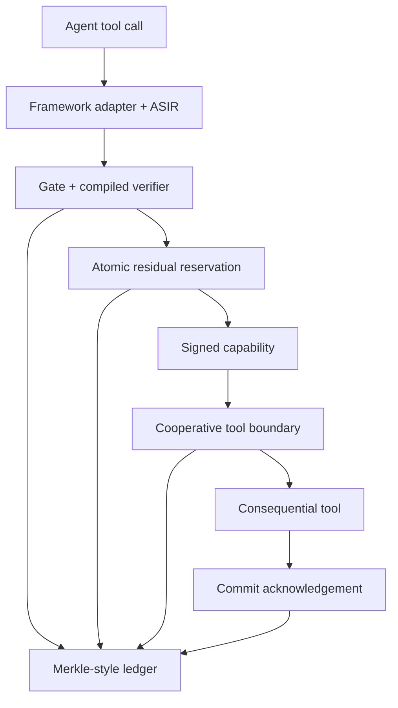

# VERITAS MVP/POC

**Verified Execution Boundary for Autonomous Agents**

VERITAS is a research proof of concept for a boundary between an autonomous agent and a
consequential tool. It answers a stricter question than a normal authorization filter:

> Is this action still safe when it is composed with the actions that came before it, executed
> concurrently with other agents, and bound to the exact state and policy that were verified?

This repository turns the *VERITAS - End-to-End MVP Plan v1.0* into a runnable Cycle-1 system.
It is deliberately local-first, transparent about limitations, and organized so that cloud
services can replace local adapters without changing domain code.

> Research and evaluation code - not a production security control. Keep the repository private
> until the prior-art and intellectual-property decision is complete. See
> [LICENSE-PROVISIONAL.md](LICENSE-PROVISIONAL.md).

## The result in one minute

The hero scenario submits twelve transfers of 900 monetary units to the same destination. Each
individual request looks safe under a 10,000-per-call filter. Together they total 10,800.

VERITAS reserves the rolling 24-hour residual atomically:

- Transfers 1-11 are authorized and commit 9,900.
- Transfer 12 is denied with `BUDGET_EXHAUSTED`.
- The ledger remains hash-verifiable.
- A unit-call-only baseline would allow all twelve.

Run it:

```bash
PYTHONPATH=src python -m veritas demo
```

Expected summary:

```json
{
  "allowed": 11,
  "denied": 1,
  "twelfth_decision": "DENY",
  "used": 9900,
  "ledger_integrity": true
}
```

The real output also lists every decision and residual.

## Quick start

### Windows PowerShell

```powershell
py -3.12 -m venv .venv
.venv\Scripts\Activate.ps1
python -m pip install -e .
veritas demo
veritas bench
python -m unittest discover -s tests -v
```

If PowerShell blocks activation, use the interpreter directly:

```powershell
.venv\Scripts\python.exe -m pip install -e .
.venv\Scripts\python.exe -m veritas demo
```

### Linux or macOS

```bash
python3.12 -m venv .venv
source .venv/bin/activate
python -m pip install -e .
veritas demo
veritas bench
python -m unittest discover -s tests -v
```

### Docker

```bash
docker compose run --rm veritas demo
docker compose run --rm veritas bench
```

No cloud account, API key, LLM, or external database is required.

## What is implemented

| Capability | Cycle-1 implementation |
| --- | --- |
| ASIR | Pydantic schema, deterministic canonical subset, stable SHA-256 hash |
| Framework normalization | Dependency-free LangGraph and MCP tool-call adapters |
| Unit policy | Reviewed JSON policy compiled into immutable runtime lookup tables |
| Class I invariants | Exact rolling-window resource reservation using SQLite `BEGIN IMMEDIATE` |
| Class II invariants | Minimal session automaton for cross-tool ordering |
| Class III invariants | Delegation-depth and actor-binding checks |
| Coordination | CAS, pre-allocated partition, and conservative hybrid modes |
| Capabilities | Short-lived Ed25519 signed envelope, state/policy/ASIR bound, one-time nonce |
| Human approval | WYSIWYS signature over the canonical ASIR and deterministic rendering |
| Tool boundary | Offline signature/content checks, nonce consumption, commit acknowledgement |
| Ledger | Append-only content-addressed chain/DAG, integrity check, trace and intervention replay |
| Uncertainty | Audited Cycle-1 bypass plus a functional split-conformal categorical field gate |
| Benchmark | Eleven attack families and two clearly defined conceptual baselines |
| Performance | Focused policy-table and cryptographic-verification microbenchmarks |

## What is intentionally not claimed

This repository does **not** claim production readiness, a completed patent search, full RFC 8785
support, PASETO compliance, production Cedar evaluation, an end-to-end Z3 proof of the Python
implementation, OIDC/SPIFFE signature validation, durable partitions, asynchronous compensation,
cloud parity, or a calibrated embedding shift detector. Those gaps are visible in
[Requirements Traceability](docs/REQUIREMENTS_TRACEABILITY.md), not hidden behind placeholder
interfaces.

The signed capability format is a POC-specific Ed25519 envelope. It is cryptographically checked,
but it must be replaced by a reviewed PASETO v4.public implementation before production use.

## How the system works



The solver is not on this path. The runtime executes table lookups, integer arithmetic, SQLite
transactions, hashes, and Ed25519 verification. The optional SMT artifact checks a bounded model
in CI.

## Useful commands

| Command | Purpose |
| --- | --- |
| `veritas demo` | Run the twelve-transfer scenario |
| `veritas bench` | Run all eleven adversarial families |
| `veritas perf --iterations 1000` | Measure RNF01/RNF02 scopes locally |
| `veritas policy-check policies/payment_policy.json` | Compile policy and show a fractionation counterexample |
| `veritas ledger-verify path/to/veritas.db` | Verify every stored ledger node |
| `python -m unittest discover -s tests -v` | Run the dependency-free test suite |
| `python tools/check_portability.py` | Reject cloud SDK imports outside adapters |
| `python tools/check_smt.py` | Run the optional Z3 bounded checks after installing dev extras |

Equivalent `make demo`, `make bench`, `make perf`, and `make test` targets are included.

## Repository map

```text
src/veritas/
  models.py              ASIR, decisions, capability contracts
  canonical.py           deterministic bytes and content hashes
  policy.py              compiler, runtime verifier, bounded check
  engine.py              Prepare + Verify orchestration
  crypto.py              local Ed25519 signer and signed envelope
  approval.py            deterministic human approval binding
  boundary.py            offline checks, execution, commit
  gate.py                deterministic bypass and conformal field gate
  adapters/
    sqlite.py            reference CAS, ledger, nonce, session stores
    partition.py         partition and hybrid coordinators
    frameworks.py        LangGraph and MCP normalization
  bench.py               eleven adversarial scenarios
  perf.py                focused microbenchmarks

policies/                 executable JSON policies and Cedar sketch
formal/                   SMT-LIB bounded model
tests/                    deterministic unit and concurrency tests
examples/                 small runnable examples
docs/                     architecture, security, benchmark, ADRs, roadmap
```

## Suggested reading paths

For a newcomer:

1. [Getting Started](docs/GETTING_STARTED.md)
2. [Glossary](docs/GLOSSARY.md)
3. `examples/hero_scenario.py`

For an engineer or architect:

1. [Architecture](docs/ARCHITECTURE.md)
2. [API Reference](docs/API_REFERENCE.md)
3. [Development Guide](docs/DEVELOPMENT.md)
4. [Requirements Traceability](docs/REQUIREMENTS_TRACEABILITY.md)

For security and research review:

1. [Threat Model](docs/THREAT_MODEL.md)
2. [Benchmark](docs/BENCHMARK.md)
3. [Formal Scope](docs/FORMAL_VERIFICATION.md)
4. [Roadmap](docs/ROADMAP.md)

## Status

- Cycle: 1, with selected Cycle-2 slices.
- Local test result: 12/12 tests passed on Python 3.12.
- Adversarial result: 11/11 defined attack families passed in the deterministic harness.
- Acceptance target microbenchmarks are machine-dependent; run `veritas perf` on the target host.
- Public release: intentionally undecided pending prior-art and IP review.

