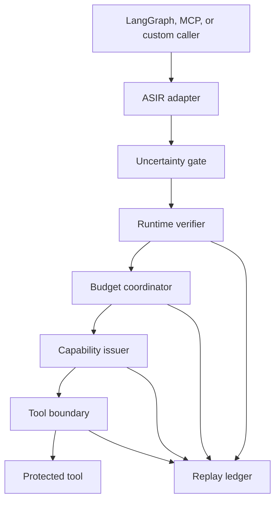
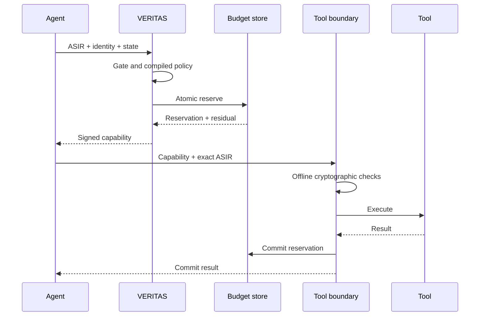

# Architecture

## Architectural objective

VERITAS is a verified execution boundary, not an agent framework. It accepts a proposed action and
upstream identity, preserves supported invariants across a trajectory, and returns either a denial,
a request for human approval, or a consumable capability.

The core scientific mechanism is the atomic transition from a global residual to a smaller residual
before a capability exists. A signature alone cannot prevent double-spend: two agents could sign or
derive successors from the same stale value. Serialization or prior partitioning is necessary.

## Component view



### ASIR adapter

The adapter converts framework-specific calls into a validated Pydantic model. It performs shape
normalization, not intent inference. The hash is derived from deterministic JSON after rejecting
floating-point values.

### Uncertainty gate

Cycle 1 records a bypass and explicitly claims no statistical guarantee. The package also includes a
split-conformal categorical field gate that:

- requires at least `ceil(1/alpha)` calibration samples;
- suspends its guarantee when shift is detected;
- sends non-singleton prediction sets to field-level review;
- refuses to be the sole control for high-risk `alpha < 0.01` actions.

It is not wired to an LLM or embedding shift monitor yet.

### Compiled verifier

`PolicyCompiler` validates a reviewed JSON artifact and creates immutable action and temporal tables.
`RuntimeVerifier` uses direct dictionary lookups and integer checks. Cedar is represented by a
documentation sketch; Z3/SMT artifacts remain CI-only.

### Budget coordinator

Three interchangeable modes implement the `BudgetStore` port:

| Mode | Mechanism | Guarantee in the POC | Main trade-off |
| --- | --- | --- | --- |
| CAS | SQLite `BEGIN IMMEDIATE`, sum and insert in one transaction | Exact rolling-window no-double-spend on one SQLite database | Serialized writes and no multi-host consensus |
| Partition | In-memory per-agent pre-allocation | No-double-spend if configured shares sum to no more than the global limit | Fragmentation and loss on restart |
| Hybrid | Static partition first, disjoint central residual second | Global use cannot exceed partition total plus central residual | Conservative fragmentation; no rebalancing yet |

The hybrid does not lend unused partition capacity to another agent. This is intentional: silent
over-allocation would violate the invariant. Asynchronous, auditable rebalancing is future work.

### Capability issuer

The issuer creates a short-lived Ed25519-signed envelope containing:

- content-derived `cap_id`;
- optional reservation identifier;
- ASIR and state hashes;
- residual values;
- policy version and compiled artifact digest;
- issuance and expiration times;
- unique nonce and key identifier;
- compact containment-certificate metadata.

The format is `veritas.v1`, not PASETO. This boundary is isolated in `crypto.py` so it can be replaced.

### Tool boundary

The boundary checks signature, canonical bytes, `cap_id`, key ID, policy version and digest,
certificate digest, TTL/skew, ASIR hash, state hash, and one-time nonce before it calls the tool. It
then commits the reservation and records an acknowledgement.

Cryptographic verification is offline. The local POC still writes the nonce and ledger to SQLite.
A production offline boundary needs a carefully scoped local anti-replay store and eventual secure
acknowledgement delivery.

### Replay ledger

Each node ID is:

```text
SHA256(trace_id, type, canonical payload, sorted parents, recorded_at)
```

Nodes are append-only by application convention. `verify_integrity()` recomputes every ID and checks
that parents appeared earlier. `replay()` substitutes selected payloads and propagates new hashes to
descendants.

SQLite does not prevent a database administrator from deleting rows and recomputing all hashes.
Production needs periodic external root anchoring in immutable storage.

## Prepare -> Verify -> Commit



If the tool errors, the reservation remains `PREPARED`. A separate compensation workflow may release
it only after confirming non-execution.

## Why the CAS path prevents double-spend

For one resource key and rolling window, the transaction performs:

1. Obtain the SQLite write lock with `BEGIN IMMEDIATE`.
2. Sum all `PREPARED` and `COMMITTED` amounts in the window.
3. Reject when `used + requested > limit`.
4. Insert the new `PREPARED` reservation before releasing the lock.

No competing writer can complete steps 2-4 using the same pre-update value. Therefore the stored sum
cannot exceed the limit, assuming SQLite provides the documented transaction semantics, every writer
uses this adapter, and the database is not maliciously modified.

## Data and privacy

The ASIR event stores the action identity and ASIR hash, not the full parameters. Tool outputs are
represented by hashes. The demo data is synthetic. A production adapter must encrypt sensitive
references, define retention, and prevent personal data from entering free-form ledger payloads.

## Ports and adapters rule

Domain code under `src/veritas/` imports no AWS, Azure, or GCP SDK. The automated portability check
enforces this. A cloud adapter must implement the existing semantic port and pass the same conformance
suite before it is considered equivalent.

The local adapter is the behavioral oracle, not a claim that SQLite is a cloud architecture.

